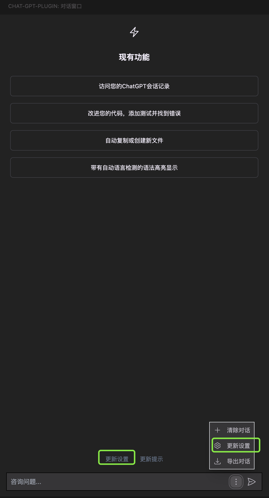
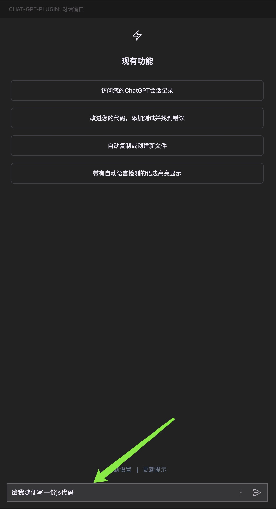
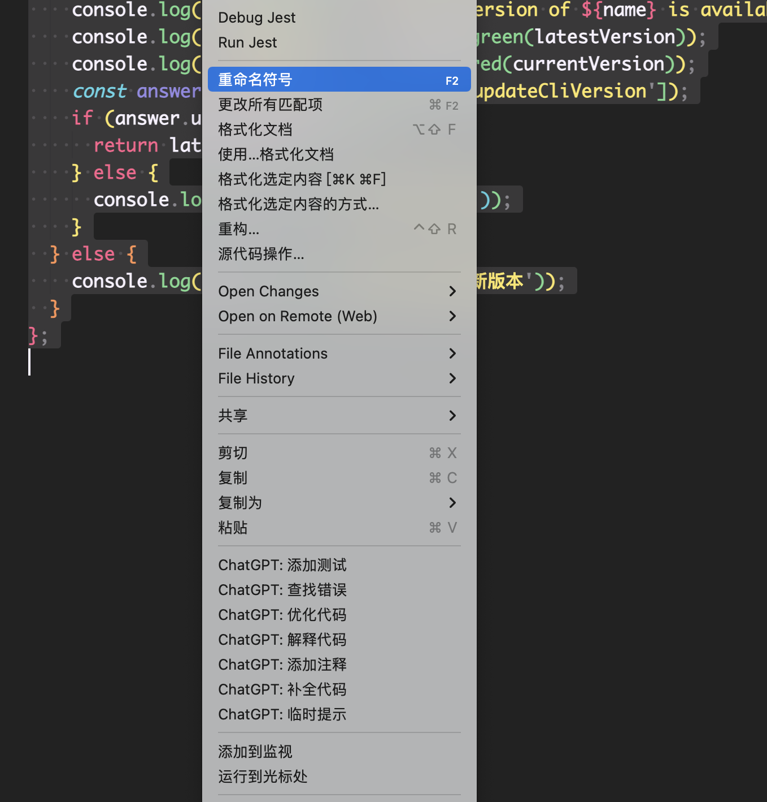

<h2 align="center">vscode-chatgpt-plugin</h2>
 

#### 介绍： vscode-chatGPT-plugin 这是一个基于 OpenAI 的强大语言模型 GPT 架构的聊天助手插件。通过 ChatGPT 插件，您可以在 Visual Studio Code 编辑器中进行自然语言交互，获得智能回答、建议和帮助，提高开发效率。

 

#### 功能介绍：

    1. 自然语言交互：提供 gpt4、gpt3.5-turbo等主流语言模型进行实时自然语言对话。
    2. 右键选中代码，提供添加测试、查找错误、优化代码、解释代码、添加注释、补全代码、临时提示等功能。gpt回答的答案会在左侧的输出面板中显示。
    3. 国际化（目前只支持中文和英文）

#### 前提条件在开始使用 VSCode ChatGPT 插件之前，请确保满足以下要求：

    安装 Visual Studio Code（版本 1.60 或更高）。拥有 OpenAI 的 ChatGPT API 密钥。请参考 OpenAI 文档获取 API 密钥。安装打开 Visual Studio Code。在扩展面板中搜索 "vscode-chatgpt-plugin"。点击 "安装" 按钮，并等待安装完成。配置安装 ChatGPT 插件后，您需要配置 API 密钥以连接到 ChatGPT 服务。

#### 请按照以下步骤进行 apikey 配置：

    1. 直接点击登录，系统会检测您是否已经配置了openai的api密钥，如果没有配置，系统会自动弹窗，让您选择存储apikey的位置，推荐存储到会话中，不推荐配置到配置中。系统会自动将您的api密钥保存到本地。

    2. 打开 chat-gpt-plugin 插件 在页面下方有更新设置、或者点击更多更新设置按钮 搜索关键字api，输入自己从openai官方申请到的apikey，至此您已经完成了配置。

#### 示例以下是 ChatGPT 的一些对话示例：

    用户： 你好，ChatGPT！如何创建一个函数？

    ChatGPT： 您好！要创建一个函数，请使用 def 关键字，后跟函数名和参数列表。例如：def my_function(arg1, arg2):。

    用户： 谢谢！你能帮我解决一个编译错误吗？

    ChatGPT： 当然可以！请提供错误消息和相关代码的详细信息，我将尽力帮助您找到解决方案。

#### 使用方法

    1. 在输入框输入任意内容，点击回车，即可开始对话。

    2. 右键选中代码，点击右键，选择您需要的功能，即可获得gpt的回答。

#### 其他

    还有一些其他的小功能，可以到config中进行配置，比如是否开启自动滚动页面、关于gpt的配置等等。

您如果喜欢该插件，可以给我一个 [star](https://github.com/xcy960815/vscode-chatgpt-plugin)，如果您有任何问题，可以在 github 上提 issue，我会尽快回复您。
