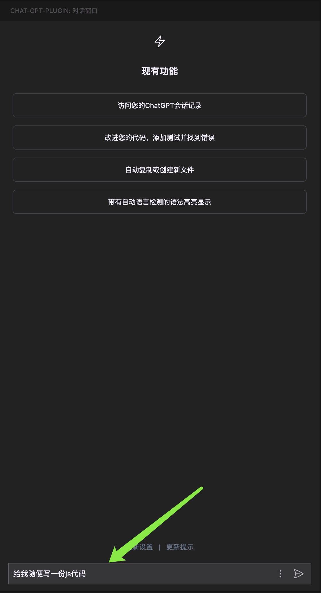
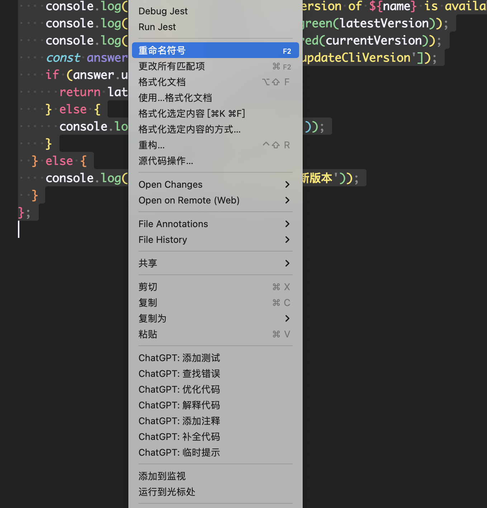
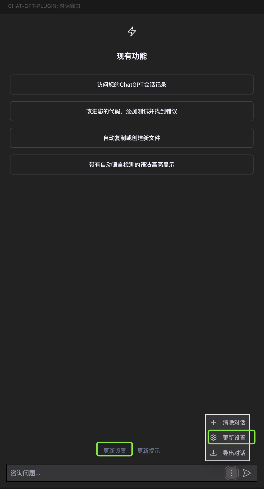

<h1 align="center">
  
  <br />
  ChatGPT Plugin for VS Code
</h1>

<p align="center">
  Chat with GPT, generate code, and get AI-powered suggestions — all inside your editor.
</p>

<p align="center">
  <a href="https://marketplace.visualstudio.com/items?itemName=xcy960815.vscode-chatgpt-plugin">
    
  </a>
  <a href="https://github.com/xcy960815/vscode-chatgpt-plugin/blob/main/LICENSE.md">
    
  </a>
  <a href="https://conventionalcommits.org">
    
  </a>
</p>

<p align="center">
  <a href="./README.md">English</a> | <a href="./README.zh-CN.md">中文</a>
</p>

---

## Features

- **Conversational AI** — Chat with GPT models directly in a sidebar panel, with streaming responses and markdown rendering.
- **Code Actions** — Select code, right-click to add tests, find bugs, optimize, explain, add comments, or complete code.
- **Modern UI** — Pure CSS design that follows VS Code theming, with dark/light mode support, message bubbles, and smooth animations.
- **Smart Defaults** — Tuned for developers: `temperature: 0.2` for deterministic output, `maxTokens: 4096` for long responses.
- **Reasoning Model Support** — Native support for OpenAI o-series reasoning models (`o1`, `o3`, `o3-mini`, `o4-mini`) with configurable `reasoningEffort`.
- **Internationalization** — Built-in support for English and 中文.

## Supported Models

| Category  | Models                                       |
| --------- | -------------------------------------------- |
| GPT-4o    | `gpt-4o`, `gpt-4o-mini`, `gpt-4o-2024-11-20` |
| Reasoning | `o4-mini`, `o3`, `o3-mini`, `o1`, `o1-mini`  |
| Legacy    | `gpt-4-turbo`, `gpt-4`, `gpt-3.5-turbo`      |

You can also enter any custom model name via the `chatgpt.gpt.customModel` setting.

## Prerequisites

- **VS Code** `>= 1.73.0`
- An **OpenAI API key** — [get one here](https://platform.openai.com/account/api-keys)
- Network access to `https://api.openai.com` (or a custom API base URL)

## Installation

1. Open VS Code and go to the Extensions panel (`Ctrl+Shift+X` / `Cmd+Shift+X`).
2. Search for **vscode-chatgpt-plugin**.
3. Click **Install**.

## Configuration

Open Settings and search for `chatgpt` to find all options:

| Setting | Default | Description |
| --- | --- | --- |
| `chatgpt.gpt.apiKey` | — | OpenAI API key (stored securely in global state) |
| `chatgpt.gpt.model` | `gpt-4o-mini` | Model to use for completions |
| `chatgpt.gpt.customModel` | — | Override with any custom model name |
| `chatgpt.gpt.reasoningEffort` | `medium` | Reasoning effort for o-series models: `low` / `medium` / `high` |
| `chatgpt.gpt.maxTokens` | `4096` | Max tokens in the response |
| `chatgpt.gpt.temperature` | `0.2` | Sampling temperature (ignored for o-series models) |
| `chatgpt.gpt.apiBaseUrl` | `https://api.openai.com` | Custom API base URL |
| `chatgpt.gpt.organization` | — | OpenAI Organization ID |
| `chatgpt.gpt.systemMessage` | _(built-in)_ | Custom system prompt |
| `chatgpt.response.autoScroll` | `true` | Auto-scroll to latest message |
| `chatgpt.response.subscribeToResponse` | `false` | Notification when AI responds |

## Usage

### Free-form Chat

Type anything in the input box at the bottom of the chat panel and press **Enter** to start a conversation.

<p align="center">
  
</p>

### Code Actions

Select code in the editor, right-click, and choose an action from the context menu:

- **Add Tests** — Generate unit tests for selected code
- **Find Bugs** — Identify potential issues
- **Optimize** — Suggest performance and readability improvements
- **Explain** — Get a plain-language explanation
- **Add Comments** — Insert meaningful comments
- **Complete Code** — Auto-complete the selected snippet
- **Ad-hoc Prompt** — Send selected code with your own custom prompt

<p align="center">
  
</p>

### API Key Setup

On first launch, click the **Login** button in the chat panel. If no API key is detected, a dialog will prompt you to enter one. The key is stored in VS Code's global state by default — it never touches your `settings.json`.

<p align="center">
  
</p>

## Development

### Prerequisites

- **Node.js** `>= 20` (managed via [Volta](https://volta.sh))
- **npm** (comes with Node.js)

### Setup

```bash
git clone https://github.com/xcy960815/vscode-chatgpt-plugin.git
cd vscode-chatgpt-plugin
npm install
```

### Scripts

| Command                | Description                                        |
| ---------------------- | -------------------------------------------------- |
| `npm run build`        | Build the extension with esbuild (with sourcemaps) |
| `npm run watch`        | Build in watch mode for development                |
| `npm run lint`         | Run ESLint on source files                         |
| `npm run lint:fix`     | Auto-fix ESLint issues                             |
| `npm run format`       | Format source code with Prettier                   |
| `npm run format:check` | Check formatting without modifying files           |
| `npm run test`         | Run ESLint + TypeScript type checking              |

### Git Hooks

This project uses [Husky](https://typicode.github.io/husky/) with [lint-staged](https://github.com/okonet/lint-staged) and [commitlint](https://commitlint.js.org/):

- **pre-commit** — Runs ESLint auto-fix and Prettier formatting on staged files.
- **commit-msg** — Validates commit messages against [Conventional Commits](https://www.conventionalcommits.org/) (e.g. `feat:`, `fix:`, `docs:`, `chore:`).

### Project Structure

```
src/
├── extension.ts              # Entry point — activation, config listeners
├── chatgpt-view-provider.ts  # WebView panel logic
├── commands.ts               # Command registration
├── config.ts                 # Centralized config manager
├── i18n.ts                   # Internationalization utilities
├── openai-service.ts         # OpenAI SDK wrapper
└── test/                     # Test suite
```

## Roadmap

See [docs/roadmap.md](./docs/roadmap.md) for the full development roadmap and current progress.

## Contributing

Contributions are welcome! Please follow [Conventional Commits](https://www.conventionalcommits.org/) for your commit messages.

## License

This project is licensed under the [MIT License](./LICENSE.md).
